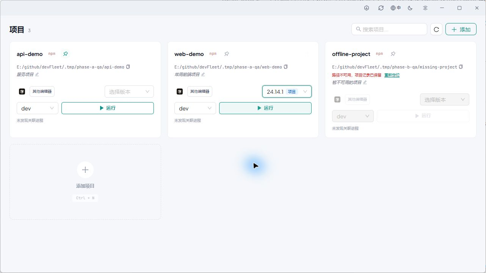

<div align="center">

# devFleet

**轻量、快速的跨平台开发项目管理工具**

[](LICENSE)
[](https://github.com/nieSugar/devFleet/releases)
[](https://v2.tauri.app)
[](https://react.dev)
[](https://www.rust-lang.org)
[]()

基于 **Tauri 2 + React 19 + TypeScript 5 + Rust** 构建，帮助开发者快速管理和启动多个 Node.js 项目。

[下载安装](#-下载安装) · [功能特性](#-功能特性) · [快速开始](#-快速开始) · [参与贡献](#-参与贡献)



<small>Windows 实机截图，使用隔离配置和演示项目。</small>

</div>

---

## ✨ 功能特性

<table>
<tr>
<td width="50%">

### 📦 项目管理
- 选择包含 `package.json` 的文件夹即可添加项目
- 自动识别 npm scripts 与包管理器（npm / yarn / pnpm / bun）
- 项目配置自动持久化，支持按名称或路径快速搜索
- 路径暂不可用时保留项目记录和备注，支持重新定位到新目录
- 常用项目可置顶，搜索时保持置顶优先
- 可选择开发目录扫描项目候选，勾选后批量导入
- 扫描最多深入 3 层、访问 5,000 个目录、展示 500 个候选；自动跳过 `.git`、`node_modules`、构建产物和目录链接
- 扫描支持取消；不会安装依赖或执行项目 scripts，只有确认勾选的项目才会导入

</td>
<td width="50%">

### 🟢 Node 版本管理
- 支持 nvmd、nvs、nvm、nvm-windows
- 为每个项目指定独立的 Node 版本
- 启动前校验指定版本；缺失、无法解析或实际版本不一致时阻止启动，并提供管理入口
- 自动生成 `.nvmdrc` / `.node-version` / `.nvmrc` 配置文件
- 远程获取 Node.js 版本列表，一键安装 / 切换 / 卸载

</td>
</tr>
<tr>
<td width="50%">

### 🚀 脚本快速启动
- 使用系统外部终端运行脚本
- 跨平台支持：Windows (cmd)、macOS (Terminal)、Linux
- 根据包管理器自动生成运行命令
- 脚本名校验，防止命令注入
- “已提交到外部终端”不代表服务已就绪；进程存在、端口监听也不等同于服务健康
- 项目卡片显示关联进程与端口，可进入按项目筛选的进程页；停止前核对进程身份

</td>
<td width="50%">

### 🖥️ 编辑器集成
- 一键在 VSCode / Cursor / WebStorm / Zed / IntelliJ IDEA / Kiro 等编辑器中打开项目
- 支持 VSCode Insiders
- 设置页动态扫描可用编辑器，并支持导入自定义编辑器
- 可设全局默认编辑器，项目卡片优先显示它；其他可用编辑器收进菜单

</td>
</tr>
<tr>
<td width="50%">

### 🎨 界面与体验
- 自定义无边框标题栏，原生窗口控制
- 浅色 / 深色主题自由切换
- 键盘快捷键操作
- 错误边界保护，防止组件崩溃

</td>
<td width="50%">

### 🔄 自动更新
- 应用内检查新版本
- 下载与安装一键完成
- 基于 Tauri Updater 插件，签名验证确保安全

</td>
</tr>
<tr>
<td width="50%">

### 🌐 国际化
- 内置中文（zh-CN）、英文（en-US）和日语（ja-JP）语言包
- 基于 i18next + react-i18next，可轻松扩展更多语言
- 界面语言自由切换

</td>
<td width="50%">

### ℹ️ 关于
- 内置关于窗口，展示版本与项目信息
- 快速获取应用状态与技术详情

</td>
</tr>
</table>

## 📥 下载安装

前往 [GitHub Releases](https://github.com/nieSugar/devFleet/releases) 下载最新版本：

| 平台 | 安装包 |
|------|--------|
| Windows | `.msi` / `.exe` (NSIS 安装版)，`.zip` (Portable 免安装版，解压即用) |
| macOS (Apple Silicon) | `.dmg` (aarch64) |
| macOS (Intel) | `.dmg` (x86_64) |
| Linux | `.deb` / `.AppImage` |

## 🛠️ 快速开始

日常使用：添加项目 → 选择已安装的 Node 完整版本与脚本 → 点击运行 → 从卡片查看关联进程和端口。项目较多时，可使用“批量导入”选择一个开发目录，扫描候选项目后手动勾选并确认导入；扫描不会自动修改项目列表，也不会安装依赖或执行 scripts。项目目录移动后，可在失效卡片上选择“重新定位”，原项目 ID 和备注会保留。当前脚本运行采用外部终端，不提供应用内托管终端；进程关联属于尽力识别，未匹配的进程仍可在全局进程页查看。

### 前置要求

- [Node.js](https://nodejs.org/) >= 22.0.0
- [pnpm](https://pnpm.io/) >= 10.14.0
- [Rust](https://www.rust-lang.org/tools/install) (stable)

### 克隆并安装

```bash
git clone https://github.com/nieSugar/devFleet.git
cd devFleet
pnpm install
```

### 启动开发模式

```bash
pnpm tauri dev
```

同时启动 Vite 前端开发服务器和 Tauri Rust 后端，支持热重载。

### 构建生产版本

```bash
pnpm tauri build
```

构建产物位于 `src-tauri/target/release/bundle/`。

## 📜 可用脚本

| 命令 | 说明 |
|------|------|
| `pnpm dev` | 启动 Vite 前端开发服务器 |
| `pnpm build` | TypeScript 编译 + Vite 构建 |
| `pnpm tauri dev` | Tauri 开发模式（前后端联调） |
| `pnpm tauri build` | Tauri 生产构建 |
| `pnpm lint` | ESLint 代码检查 |
| `pnpm lint:fix` | ESLint 自动修复 |
| `pnpm format` | Prettier 代码格式化 |
| `pnpm icon` | 从 logo.png 生成多平台应用图标 |

## 🏗️ 技术栈

| 层 | 技术 |
|----|------|
| 框架 | [Tauri 2](https://v2.tauri.app) — 轻量级跨平台桌面框架 |
| 前端 | [React 19](https://react.dev) + [TypeScript 5.9](https://www.typescriptlang.org/) + [Vite 8](https://vite.dev) |
| UI | [Ant Design 5](https://ant.design/) + [@ant-design/icons 6](https://ant.design/components/icon) + [@lobehub/icons](https://github.com/lobehub/lobe-icons) |
| 国际化 | [i18next](https://www.i18next.com/) + [react-i18next](https://react.i18next.com/) |
| 字体 | [Plus Jakarta Sans](https://fonts.google.com/specimen/Plus+Jakarta+Sans) + [JetBrains Mono](https://www.jetbrains.com/lp/mono/) |
| 后端 | [Rust](https://www.rust-lang.org/) (serde · ureq · tokio · chrono · regex-lite · zip · flate2 · tar) |
| 插件 | Tauri Dialog · Updater · Process |
| 代码质量 | [ESLint 9](https://eslint.org/) (flat config) + [Prettier](https://prettier.io/) + Clippy + rustfmt |
| CI/CD | GitHub Actions — 前后端 CI 检查 + 多平台自动构建与发布 |

## 🗂️ 项目结构

<details>
<summary>点击展开</summary>

```
src/                              # 前端源码 (React + TypeScript)
├── renderer.tsx                  # 应用入口
├── App.tsx                       # 根组件（主题 / 布局）
├── App.css                       # 根组件样式
├── index.css                     # 全局样式与 CSS 变量
├── components/
│   ├── TitleBar.tsx              # 自定义标题栏（窗口控制 / 主题切换）
│   ├── TitleBar.css
│   ├── ProjectManager.tsx        # 项目列表与搜索
│   ├── ProjectManager.css
│   ├── ProjectCard.tsx           # 项目卡片
│   ├── ProjectCard.css
│   ├── ProjectHeader.tsx         # 项目头部信息
│   ├── EditorButton.tsx          # 编辑器快捷按钮
│   ├── NodeVersionDrawer.tsx     # Node 版本管理抽屉
│   ├── NodeVersionDrawer.css
│   ├── NodeVersionSelect.tsx     # Node 版本选择器
│   ├── UpdateChecker.tsx         # 应用更新检查
│   ├── UpdateChecker.css
│   ├── AboutWindow.tsx           # 关于窗口
│   ├── AboutWindow.css
│   └── ErrorBoundary.tsx         # 错误边界
├── contexts/
│   └── ThemeContext.tsx           # 主题上下文
├── pages/
│   ├── AppShell.tsx               # 应用窗口壳层
│   └── MainWindowPage.tsx          # 主窗口页面
├── routes/
│   └── createAppRouter.tsx         # 应用路由
├── theme/
│   └── antdTheme.ts                # Ant Design 主题配置
├── hooks/
│   ├── useProjects.ts            # 项目数据管理
│   ├── useEditors.ts             # 编辑器检测
│   ├── useNvmInfo.ts             # NVM 信息
│   ├── useNodeProcesses.ts       # 单实例进程查询与可见性轮询
│   └── useKeyboardShortcuts.ts   # 快捷键绑定
├── i18n/                         # 国际化
│   ├── index.ts                  # i18next 初始化配置
│   └── locales/
│       ├── zh-CN.json            # 中文语言包
│       ├── en-US.json             # 英文语言包
│       └── ja-JP.json             # 日语语言包
├── lib/
│   ├── tauri.ts                  # Tauri IPC 命令封装
│   ├── autostart.ts              # 开机自启动
│   ├── macosNative.ts            # macOS 原生集成
│   └── projectEvents.ts           # 项目变更事件
├── types/
│   ├── project.ts                # 类型定义
│   └── assets.d.ts               # 静态资源类型声明
└── assets/                       # 静态资源
    └── app-icon.png

src-tauri/                        # 后端源码 (Rust + Tauri)
├── src/
│   ├── main.rs                   # 程序入口
│   ├── lib.rs                    # Tauri 启动与命令注册
│   ├── commands.rs               # IPC 命令实现
│   ├── candidates.rs             # 编辑器候选扫描与导入
│   ├── config.rs                 # 配置文件读写
│   ├── detector.rs               # 包管理器 / 编辑器 / NVM 检测
│   ├── editors.rs                # 编辑器配置与启动
│   ├── icons.rs                  # 编辑器图标
│   ├── models.rs                 # 数据模型
│   ├── node_manager.rs           # Node.js 版本下载 / 安装 / 卸载
│   ├── node_processes.rs          # Node 进程信息
│   ├── project.rs                 # 项目逻辑
│   └── shell_context.rs           # 外部终端上下文
├── capabilities/                 # Tauri 权限声明
├── icons/                        # 应用图标（多平台多尺寸）
├── Cargo.toml
└── tauri.conf.json
```

</details>

## 📁 配置文件位置

| 操作系统 | 路径 |
|---------|------|
| Windows | `%APPDATA%/devfleet/devfleet-config.json` |
| macOS | `~/Library/Application Support/devfleet/` |
| Linux | `~/.local/share/devfleet/` |

## 🤝 参与贡献

修改运行状态相关逻辑后，可运行 `pnpm dev` 并打开 `http://localhost:1420/scripts/check-project-hooks.html`，执行不读取用户配置的 10 项 hook 回归检查；页面应显示 `PASS (10)`。后端回归使用 `cargo test --manifest-path src-tauri/Cargo.toml`。

欢迎任何形式的贡献！

1. **Fork** 本仓库
2. 创建特性分支：`git checkout -b feature/your-feature`
3. 提交更改：`git commit -m "feat: add your feature"`
4. 推送分支：`git push origin feature/your-feature`
5. 发起 **Pull Request**

> 提交信息建议遵循 [Conventional Commits](https://www.conventionalcommits.org/) 规范。

## 📄 License

本项目基于 [MIT License](LICENSE) 开源。

---

<div align="center">

**Made with ❤️ by [nieSugar](https://github.com/nieSugar)**

如果觉得有用，欢迎 ⭐ Star 支持一下！

</div>
